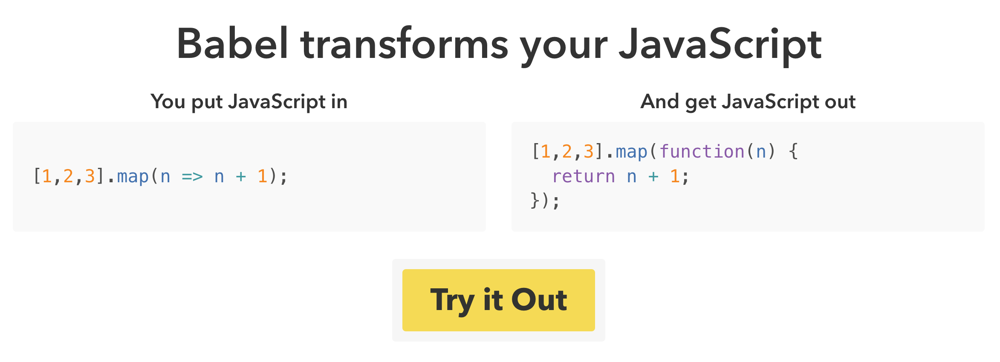

# Module 14: Introduction to React

## Overview
React is _a JavaScript library for building user interfaces_. Using the React library will enable you to create reusable components that you can combine into robust web applications. We'll continue the pursuit of using **data** to drive web applications by using a structure in which we pass different _data_ to _components_ we create.

Because React is such a popular and configurable library, people use it in complex ways in conjunction with a variety of different tools to manage complex applications. We'll introduce a number of these tools as the course moves forward, but we'll start as simple as possible -- just be aware that some of the examples you find online (even [Facebook's React Tutorial](https://facebook.github.io/react/tutorial/tutorial.html)) may leverage additional tools to "simplify" the process.

<!-- START doctoc generated TOC please keep comment here to allow auto update -->
<!-- DON'T EDIT THIS SECTION, INSTEAD RE-RUN doctoc TO UPDATE -->
**Contents**

- [Resources](#resources)
- [Modern JavaScript](#modern-javascript)
  - [Arrow Functions](#arrow-functions)
  - [Babel](#babel)
- [React Set-up](#react-set-up)
- [Creating Components](#creating-components)
- [Passing Props](#passing-props)
- [Nesting Components](#nesting-components)
- [Component State](#component-state)
- [Events](#events)

<!-- END doctoc generated TOC please keep comment here to allow auto update -->

## Resources

**Tutorials**
- [Simple React Examples](http://tutorialzine.com/2014/07/5-practical-examples-for-learning-facebooks-react-framework/)
- [Facebook's React Tutorial](https://facebook.github.io/react/tutorial/tutorial.html)
- [React Documentation](https://facebook.github.io/react/docs/hello-world.html)
- [JSX Documentation](https://facebook.github.io/react/docs/introducing-jsx.html)
- [React if you know jQuery](http://reactfordesigners.com/labs/reactjs-introduction-for-people-who-know-just-enough-jquery-to-get-by/)
- [Thinking in React](https://facebook.github.io/react/docs/thinking-in-react.html)
- [React Component Lifecycle](https://facebook.github.io/react/docs/react-component.html)

**Tools**
- [Babel JavaScript Compiler](https://babeljs.io/)
- [React Chrome Extension](https://chrome.google.com/webstore/detail/react-developer-tools/fmkadmapgofadopljbjfkapdkoienihi)

**ES 6**
- [ES6 Arrow Functions](https://developer.mozilla.org/en-US/docs/Web/JavaScript/Reference/Functions/Arrow_functions)
- [JavaScript `let` Function](https://developer.mozilla.org/en-US/docs/Web/JavaScript/Reference/Statements/let)
- [JavaScript `const` Function](https://developer.mozilla.org/en-US/docs/Web/JavaScript/Reference/Statements/const)
- [ES6 Features](http://es6-features.org/#Constants)

## Modern JavaScript
JavaScript is evolving, which is a good thing! **ECMAScript 6**, also referred to as **ES6** is the latest release of JavaScript standards (released in 2015). This introduced a number of syntactical additions that make writing JavaScript easier. Because you'll see them frequently in React examples, they are introduced here (you _don't need to use ES6_ syntax to use React). You can learn about the new features [here](http://es6-features.org/#Constants), such as [Arrow Functions](https://developer.mozilla.org/en-US/docs/Web/JavaScript/Reference/Functions/Arrow_functions).

### Arrow Functions
Writing anonymous inline functions is somewhat cumbersome, and the **arrow function** introduced a simplified syntax for writing them:

```javascript
// Some data
var data = [1, 2, 3];

// Typical in-line anonymous function
var dataSquared = data.map(function(d){return d^2});

// Arrow function
var dataSquared = data.map((d)=> d^2); // much simpler!
```
You'll notice that for your arrow function, you simply begin with your parentheses `()`, followed by an arrow, and then the result that you want to return (without the word `return`).

### Babel
While ES6 became the web standard in 2015, it is not yet adopted by all browsers (i.e., the arrow function **does not work in safari**). To ensure that our code will run in all browsers, we can use the `babel` service to translate from ES6 to ES5 (earlier version of JavaScript). As noted on the [babel website](https://babeljs.io/), you _put JavaScript in, get JavaScript out_:



Later on, we'll learn how to compile our JavaScript as part of the process of building a website, but for now, we can simply use the following script tag to compile our JavaScript in our browser:


```html
<!-- In your index.html file -->
<!-- Load Babel -->
<script src="https://cdnjs.cloudflare.com/ajax/libs/babel-standalone/6.14.0/babel.min.js"></script>

```
In addition to compiling our ES6 JavaScript o ES5, it will also allow us to start writing in JSX....

##JSX
Haven't you ever wanted to just start writing HTML in the middle of your JavaScript file? Now you can, with JSX! It sounds like a bit of a silly idea, but this is something we've been doing with jQuery for a few weeks now, the HTML syntax has just been in strings:

```javascript
// Making HTML elements with regular old jQuery
var img = $('').attr('src', 'URL/TO/IMG')

$('body').append('img');
```

As the complexity of the items that we create increases, this becomes quite cumbersome. You often run into people writing some pretty messy code with jQuery, like this:

```javascript
// What a mess!
var myComplexElement = $("<div class='card horizontal'>\
                <div class='card-image'>\
                    \
                </div>\
                <div class='card-stacked'>\
                    <div class='card-content'>\
                        <p>" + card.content + "</p>\
                    </div>\
                    <div class='card-action thumb'>\
                    <i class='small material-icons'>thumb_up</i>\
                    <span id='likes-" + key + "'>" + tweet.likes + "</span>\
                    </div>\
                </div>\
            </div>\
            ");
```

While this achieves the desired output, it's both difficult to write and difficult to read. Luckily, JSX introduces a syntax in which we can start writing HTML throughout a JavaScript file. We'll get into how React uses this below, but the general pattern looks like this:

```javascript
// Function to render an html element
var render = function() {
    // Write some js
    var text = "this is my first paragraph";
    var text2 = "this is my second paragraph";
    // Return a single HTML element, with other elements inside of it
    return(
            <div>
                <p>{text}</p>
                <p>{text2}</p>
            </div>
    );
};
```

In the above code section, we begin to mix HTML in directly with our JavaScript. The `return` statement above is returning a single HTML node (i.e., one root element, which may have as many children as you like). The curly braces syntax `{text}` allows us to **reference JavaScript variables** inside of our HTML node. Much cleaner than jQuery!

In order to specify that babel should compile your JSX code to JavaScript, **make sure to include** `type=text/jsx` in your script tag referencing your `.jsx` file!

```html
<!-- Load jsx file, make sure to specify type -->
<script type="text/jsx" src="main.jsx"></script>
```

## React Set-up
In order to start using React, we'll actually need to read in _two_ script tags: one to use React, and a separate one specifically designed for DOM manipulation (ReactDOM):

```html
<script src="https://unpkg.com/react@15/dist/react.js"></script>
<script src="https://unpkg.com/react-dom@15/dist/react-dom.js"></script>
```

Also, for reasons that will become clear, it will be helpful to install [this chrome extension](https://chrome.google.com/webstore/detail/react-developer-tools/fmkadmapgofadopljbjfkapdkoienihi) to help view the components you create.

## Creating Components
Wouldn't it be great if we could create _our own HTML elements_? For example, what if we were able to define a `<Tweet>` element for a Twitter application? That's what React will enable us to do. Once we create components, we'll be able to refer to them as if they were regular HTML elements (and pass _properties_ to those elements):

```html
<!-- Show a Twitter component -->
<Tweet text="Some text for the tweet" user="Username" />
```
To create a component, we'll use the `React.createClass` method. This will create a new class of component with **default React Behaviors** that we can use throughout our application. This method expects an _object_ as a parameter. In that object, you can specify _methods_ for your new component, such as how to render it:

```javascript
var MyComponent = React.createClass({
    // A function to render your component -- should return HTML
    render:function() {
        // Write some js
        var text = "this is my first paragraph";
        var text2 = "this is my second paragraph";
        return(            
            <div>
                <p>{text}</p>
                <p>{text2}</p>
            </div>
        )
    }
});
```

Once we have defined a component, we can use the `ReactDOM` library to render it to the DOM:

```javascript
// Render MyComponent in the body
ReactDOM.render(<MyComponent/>, document.querySelector('body'));
```
The `ReactDOM.render` method takes two parameters: the `component` that you want to render (`<MyComponent/>`), and where you want to render it (the `body`). For some practice creating a simple element, see [exercise-1](exercise-1).


## Passing Props
When you create a React component, you can **pass it properties** in the same way that you would specify HTML attributes. _Properties_ are pieces of data that your component can use to display data that it is passed, making it a flexible templating system:

```javascript
// Render MyComponent, passing data to it through props:
ReactDOM.render(<MyComponent p1="paragraph 1" p2="paragraph 2"/>,
    document.querySelector('body')
);
```
The values passed to a component are accessible within the component as `this.props`. This will allow us to dynamically show information that is passed to the component:

```javascript
var MyComponent = React.createClass({
    // A function to render your component -- should return HTML
    render:function() {
        // Write some js        
        return(            
            <div>
                <p>{this.props.p1}</p>
                <p>{this.props.p2}</p>
            </div>
        )
    }
});
```

The components that you create have **lifecycle** methods that help keep the DOM up to date as your data changes. For an overview of these methods, you can see the [documentation](https://facebook.github.io/react/docs/react-component.html). For now, it's important to note that a number of functions are invoked **by default** when you change your `props` or your `state` (more on this below). **When your `props` change, your `render` method will be called** (as will a number of other functions to allow you to control the flow of information).

To practice passing simple information via props, see [exercise 2](exercise-2).


## Nesting Components
Once we've created components, we can render them inside of other components, just like regular HTML elements! This is a core idea to React, as it uses a **one-directional data flow** where _parent_ components pass data to child components.

Let's imagine that we want to create a list (pretty simple, right?). For each list item (`<li>`) that we want to create, we could render a React component (`ListItem`).

Let's start by creating a ListItem component:
```javascript
// Simple ListItem component for showing an <li>
var ListItem = React.createClass({
    render:function() {
        return(<li className={this.props.status}>{this.props.text}</li>)
    }
});
```
The above section is written to accept two properties: `status` and `text`. Note, because the word `class` is a protected word in JavaScript, we **have to use `className`** to assign a class.

Now we can create a `List` component to render all of our `ListItem` components.

```javascript
// Data to pass to our List elements
var items = [
    {text:"Go to the store", status:"complete"},
    {text:"Go to class", status:'incomplete'}
];

// Simple ListItem component for showing an <li>
var List = React.createClass({
    render:function() {
        return(
            <div>
                { // Iterate through items
                this.props.items.map(function(item, index){
                    return <ListItem key={'item-' + index} status={item.status} text={item.text} />
                })
                }
            </div>
        )
    }
});
```
In the above section, we open up a JavaScript section _inside_ of the `<div>` element that we're going to return. We can then access the items via `this.props.items` and iterate through them with the `.map` function. Each iteration will _return_ a `ListItem`, which we'll assign a unique **key**.

Finally, we'll pass our `items` data to our `List` component and render it:

```javascript
// Render your component in the `main` section
ReactDOM.render(<List items={items}/>,
    document.querySelector('main')
);
```
To see how this example works, you can view [demo-1](demo-1), or practice in [exercise-3](exercise-3).

## Component State
So far, we've been discussing how components can receive _properties_ to determine their visual rendering. It's put nicely in [this write-up](https://github.com/uberVU/react-guide/blob/master/props-vs-state.md):

>_props_ (short for properties) are a Component's configuration, its options if you may. They are received from above and immutable as far as the Component receiving them is concerned.
>A Component **cannot change its props**, but it is responsible for putting together the props of its child Components.

So, we use **props** to pass data into components which render that data. However, if we want to begin building dynamic applications, we'll need to use **component state** to track change in the _state_ of the application (usually driven by a user).

A really nice overview of the difference between props and state is in [this article](https://facebook.github.io/react/docs/thinking-in-react.html), which points out a few key ideas:

- "State is reserved only for interactivity, that is, data that changes over time"
- Keep your state _as minimal as possible_, and compute information from that state

So, for example, if you wanted to have a _searchable list_, that component would recieve the list items as an array which would not change -- this means that it is part of **props**. However, the search string will change, so we can store the search string in **state**, and _compute the filtered list_ in our `render()` function. We can begin by setting an initial state, as the `getInitialState` is fired when the Component is initialized:

```javascript
// Component for searching a table
var SearchableTable = React.createClass({
    // Set an initial state: it will then be accessible as this.state.NAME
    getInitialState:function() {
        return({searchString:''}); // Initial state of searchString as '';
    },
    render:function {
        // Use searchstring to filter data

        ...

        // Render a table in here
        return(...dom elements ...);
        ...
    }
});
```
If we were building a searchable table, the only thing that changes, and therefore the **only data we need to store in state**, is the search string -- we can then filter down our data in the `render` function.

## Events
Event handlers are assigned in React in the same way that you would assign them to an HTML element using the event name of your choice. Inside of a `.jsx` file, we could leverage the curly braces `{}` inside an HTML section to reference a JavaScript function.

```html
<input onChange={functionName} />
```

What we need to figure out is _what to do in that function_. Rather than trying to update elements ourselves, we can simply **update the state**, and let React take care of the rest. When we change state or props, React will re-render our components. Continuing with our example of a searchable table, we could define a function _as part of our component_ that _changes it's state_, and then our UI will be re-rendered:


```javascript
// Component for searching a table
var SearchableTable = React.createClass({
    // Set an initial state: it will then be accessible as this.state.NAME
    getInitialState:function() {
        return({searchString:''}); // Initial state of searchString as '';
    },
    // Define a `filter` function to be executed when the input element changes
    filter:function(event) {
        // Get event value
        var value = event.target.value;

        // Change state
        this.setState({searchString:value});
    }
    render:function {
        // Use searchstring to filter data

        ...

        // Render a table in here
        return(
            <input onChange={this.filter} />
            ...dom elements...
        );
        ...
    }
});

```
In the above section, the `filter` function (which we define -- this **is not** a default React function) will be executed when the `<input>` element changes value. The `filter` function then set's the state using `this.setState({key:value})`. Note **do not** try setting the state directly (i.e., `this.state.searchString = 'something'`). By setting the state, you will **trigger an update**, and React will re-render your DOM.

To practice working with state, see [exercise-4](exercise-4).
