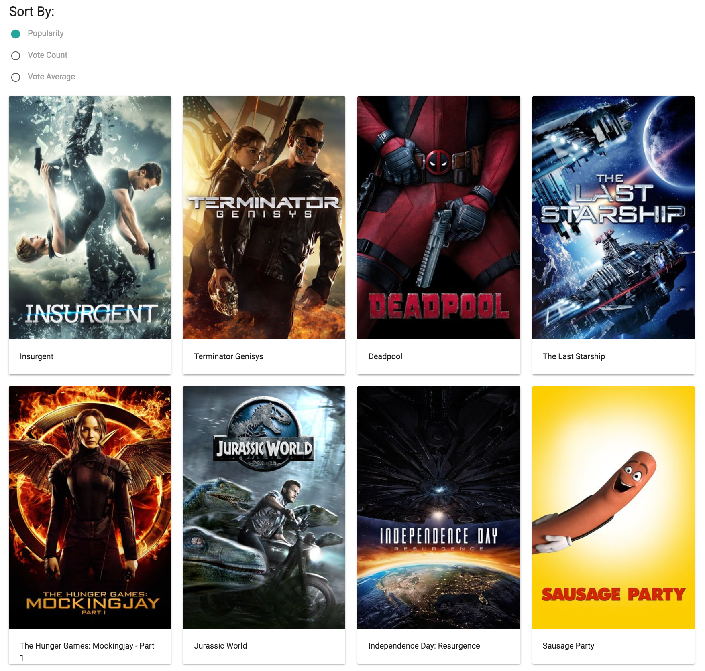

# Exercise-5
In this exercise, you'll practice reading data into a React application that you build, and sorting that data. You're final product will look like this:

After you fork and clone the repository, you should do the following:

## MovieApp Component
The `MovieApp` component is already defined for you, though the functions are currently blank. You should fill them in as follows:

- In your `getInitialState` function, set your `movies` state to an empty array, and your `order` state to `popularity`. This will set the state of your component

- Write your `setOrder` function to use the `setState` method of your component to set the `order` state to `element.target.id` (this is because we'll assign this event to an `<input>` element with a specific `id`)

- Make sure you understand how the `getMovies` and `sortMovies` functions work!

- Fill in your `componentDidMount` function so that, when your component mounts, you retrieve your data

- In your `render` function, store an array of your **sorted movies** by passing your `movies` and `order` to the `sortMovies` function (don't forget your `this` context)

- Then, your `render` function should return a `
` in which you put:
        - A `MovieControls` element, into which you should pass your `setOrder` function through a property called `clickEvent`
        - A `MovieItem` element for each item in your `sortedMovies` array. Pass in a prop called `data`, which has the information about the movie

## MovieItem Component
Your `MovieItem` component will receive information from your `MovieApp` (via `props`). You should use that information to populate your card. Specifically:

- Set the `src` value of your `image` tag to the appropriate URL: hint, you'll need to combine your `imageUrl`, the `poster_path` attributes of the data passed to `props`, and your `apiKey`

- Set the text of the `
` element to the title of your movie

## MovieControls Component
Your `MovieControls` component will receive a **function** via `props`, which you should assign as the `onClick` event to _each_ of your `<input>` elements.

- Set the `onClick` event to each `<input>` element that was passed via `props`.

You should now be able to see a card for each movie, and sort them via the controls.
